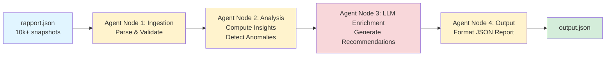

# Infrastructure Monitoring & Optimization Agent

## Agent Architecture

Autonomous multi-node LangGraph agent implementing intelligent infrastructure analysis through sequential reasoning:



**Agent Flow:**
```
Ingestion → Analysis → LLM Enrichment → Output
```

### Agent Node Functions

1. **Ingestion Node**: Loads and validates 10k+ monitoring snapshots from JSON
2. **Analysis Node**: Computes aggregated insights and detects SLA violations via threshold-based detection
3. **LLM Enrichment Node**: Generates contextual recommendations using OpenAI GPT-4
4. **Output Node**: Exports structured JSON report conforming to specification schema

## Agentic Design

This solution implements an **autonomous agent** using LangGraph's state machine architecture:

- **State Management**: Shared GraphState passed between nodes enables context retention
- **Sequential Reasoning**: Each node performs specialized analysis before passing to next stage
- **LLM Integration**: Agent leverages GPT-4 for intelligent recommendation generation
- **Deterministic + Generative**: Combines rule-based anomaly detection with AI-powered insights

## Technical Stack

- **LangGraph**: Multi-node agent orchestration and state management
- **Pydantic**: Schema validation and type safety
- **OpenAI GPT-4**: LLM-powered contextual reasoning
- **Python 3.9+**: Core implementation language

## Installation

```powershell
pip install -r requirements.txt
```

Create `.env` file:
```
OPENAI_API_KEY=your_key_here
```

## Execution

```powershell
python main.py
```

Output: `output.json`

## Design Decisions

### Anomaly Detection
- **Current**: Statistical thresholds based on business SLAs (CPU > 85%, latency > 250ms, etc.)
- **Production**: ML-based models (Isolation Forest, ARIMA for time-series)

### Recommendations
- **Current**: LLM-generated for contextual, business-oriented actions
- **Production**: Hybrid rule engine + LLM fallback for cost optimization

### Data Processing
- **Current**: In-memory batch processing
- **Production**: Streaming architecture (Kafka/Kinesis) with incremental aggregation

### Scalability Considerations
- Deduplication logic prevents anomaly explosion
- Severity scoring prioritizes critical issues
- JSON schema validation ensures output contract compliance

## Code Structure

```
main.py           - Agent orchestration and entry point
nodes.py          - Agent node implementations
models.py         - Pydantic data schemas
rapport.json      - Input monitoring data (10k+ snapshots)
output.json       - Generated analysis report
test_pipeline.py  - Unit tests for agent nodes
validate.py       - Output schema validation
```

## Business Value

- **Autonomous Analysis**: Agent processes infrastructure data without human intervention
- **Intelligent Recommendations**: LLM-generated actions provide contextual optimization paths
- **MTTR Reduction**: Automated anomaly detection accelerates incident response
- **System Integration**: Structured output enables alerting/ticketing system integration
